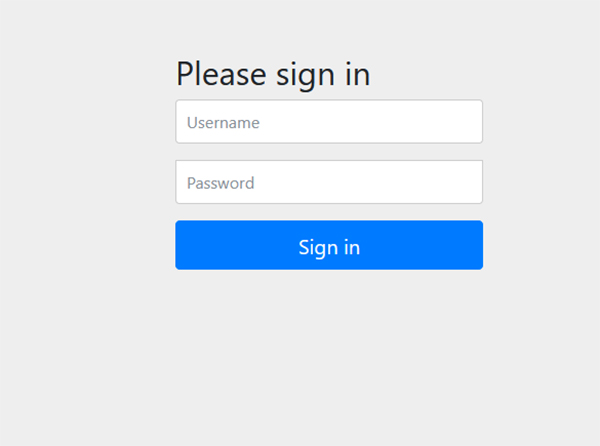
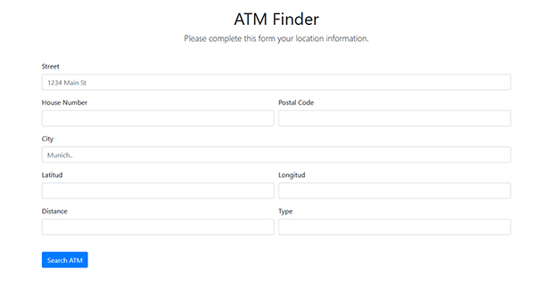
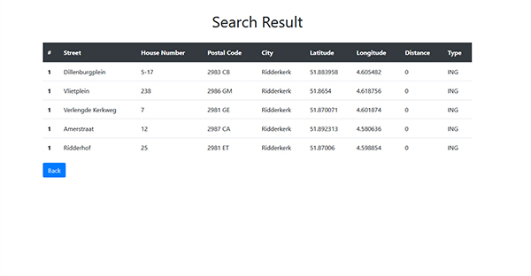

# ATM Finder

### Description
The app can find a list of atm filtered by some params included on the serach form.

You can search by any field on the form. If you use more filters, the result will be more specific. 

### App modules
The app are divided on 3 parts. A login area, a main area with the search form and a response area. 

#### 1. Logging
The app use the Spring Security module to ensure the secure access.
At the start you have a login form to access to de main area.

```
Use the followings credentials:

    - user:admin
    - password:admin
```
With this credentials, you can will access to the search area.





#### 2. Search form
The main area have an HTML form to filter the search.
You can complete any field of the form to make a specific request.



#### 3. Response Area
The form send a request to the controller to find an ATM on the list.
If the service find ones, will return a list with the response and show it them in a HTML table.
If the service can't find any result, will return a message.



### Technology
To build this app, the following tools were used:
    
    - Java 8
    - Spring Boot Framwork
    - Spring Security
    - Bootstrap Framework
    - Thymeleaf web Framework